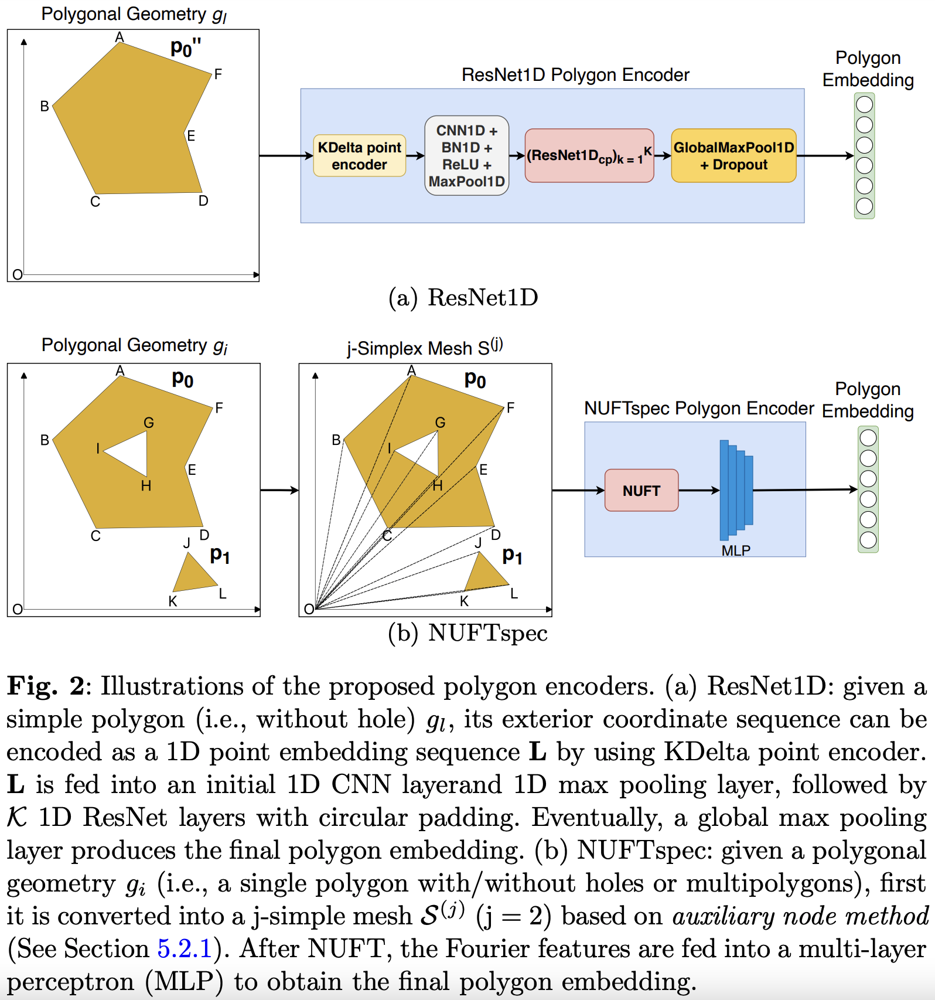

# IE402 Project – Research on General-Purpose Representation Learning of Polygonal Geometries

## Source Code & Related Content

- **GitHub Repository (Original Research Paper)**  
  [🔗 GitHub – polygon_encoder](https://github.com/gengchenmai/polygon_encoder)

- **Model Training & Evaluation (Colab)**  
  [🔗 Colab – Model Training](https://colab.research.google.com/drive/1lTanYey5ZxqTCpBBdljNicaBrRVLjukw?usp=sharing)

- **Prediction Demo**  
  [🔗 Colab – Spatial Relation Prediction](https://colab.research.google.com/drive/1j9fGgpyP7h1zjPXYtubU2kLxvBwt8esd?usp=sharing)

- **Presentation Slides**  
  [🎤 Canva – GIS3D Presentation](https://www.canva.com/design/DAGZ7VVZdps/rjEIxWjiSedOkJWqkj8PfQ/edit)

- **Streamlit Demo**  
  [🔗 Streamlit – GIS3D Demo](https://drive.google.com/file/d/1LVCVglIr1SnxvLbCCbzM4_GEEOswx-sZ/view?usp=sharing)

---

## 📄 Related Links

1. [Springer Paper (GeoInformatica 2023)](https://link.springer.com/article/10.1007/s10707-022-00481-2)  
2. [arXiv Preprint](https://arxiv.org/abs/2209.15458)

---

## 🧠 Model Overview

<p align="center">
  
</p>

---

## 📦 Dependencies

Required Python packages are listed in `requirements.txt` and additional setup instructions.

---

## 📂 Dataset

Download the **DBTopo** datasets from this [Dropbox folder](https://www.dropbox.com/scl/fo/ubokquibjibxqb71lduto/h?rlkey=gnex7g3gx51g06gmd1v1um9u1&dl=0) and place them into the directory:  
`./data_proprocessing/dbtopo/output/`

### The folder contains:

1. **DBSR-46K**  
   - File: `pgon_triples_geom_300_norm_df.pkl`  
   - A `GeoDataFrame` containing spatial relation prediction data generated from DBpedia and OpenStreetMap. Each row represents a triple from DBpedia, where the subject and object are represented as simple polygons (300 vertices each).

2. **DBSR-cplx46K**  
   - File: `pgon_triples_geom_300_norm_df_complex.pkl`  
   - Similar to DBSR-46K, but the polygons are complex (with 300 vertices) for both subject and object.

---

## 🚀 Training and Evaluation

All core code is located in the `polygoncode/` directory.

To perform supervised training on both datasets:

```bash
bash 1_pgon_dbtopo.sh
```

This script trains models on both **DBSR-46K** and **DBSR-cplx46K**.

---

## 📝 Citation

If you find this project helpful in your research, please consider citing the **GeoInformatica 2023** paper:

```bibtex
@article{mai2023towards,
  title={Towards general-purpose representation learning of polygonal geometries},
  author={Mai, Gengchen and Jiang, Chiyu and Sun, Weiwei and Zhu, Rui and Xuan, Yao and Cai, Ling and Janowicz, Krzysztof and Ermon, Stefano and Lao, Ni},
  journal={GeoInformatica},
  volume={27},
  number={2},
  pages={289--340},
  year={2023},
  publisher={Springer}
}
```

---

## 👨‍🏫 Author

For more information on **Spatially Explicit Machine Learning and AI**, visit:  
[🔗 Dr. Gengchen Mai’s Homepage](https://gengchenmai.github.io/)
